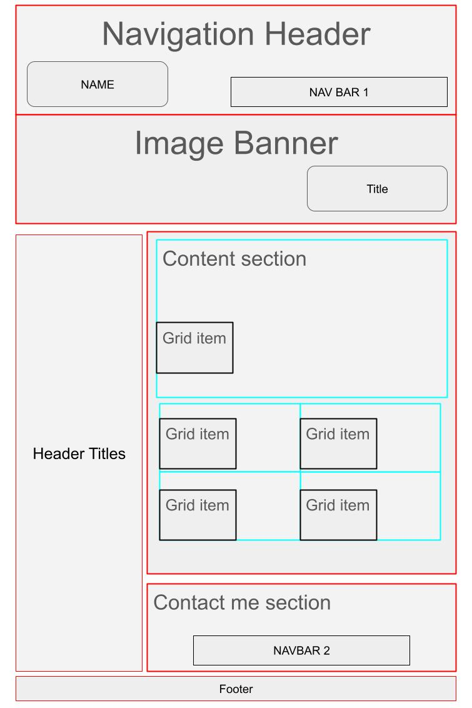
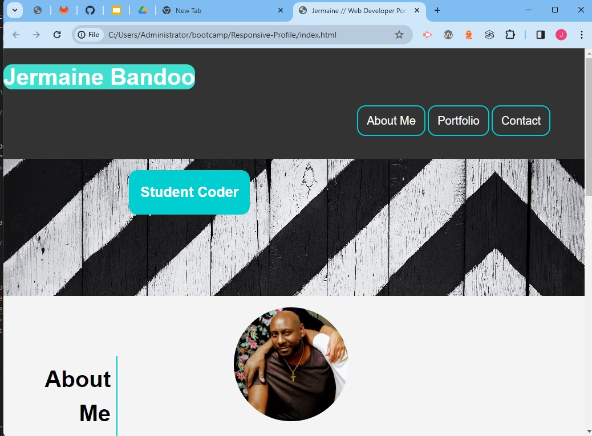
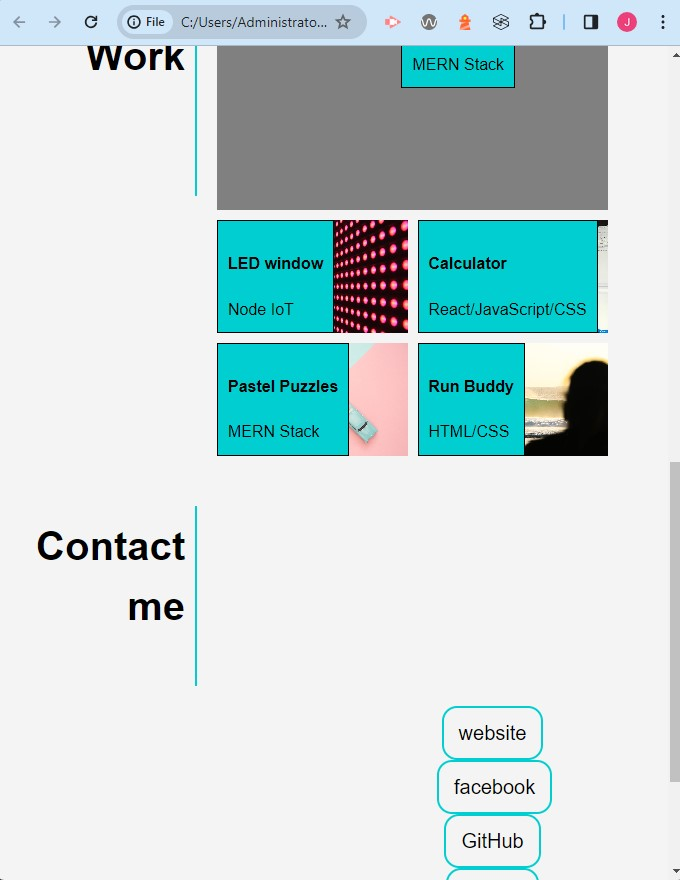

# Responsive Student Profile

## Description
Development of a dynamic student portfolio page.

## Table of Contents

- [Project Overview](#project-overview)
- [Features](#Features)
- [Installation](#installation)
- [contributing](#contibuting)
- [Usage](#usage)
- [License](#License)
- [credits](#credits)
- [Contact](#Contact)

## Project Overview
This week's project involves the development of a dynamic portfolio page that will serve as a showcase of my skills and accomplishments throughout the course. The primary goal is to create a visually appealing and functional portfolio that not only highlights my technical abilities but also provides insight into my thought processes behind the showcased work.

1. **Skill Demonstration:** Showcase your proficiency in applying recently learned core skills, including flexbox, media queries, and CSS variables.
2. **Career Preparation:** Lay the foundation for future success in your career search by creating a portfolio that stands out to potential employers.
3. **Deployed Projects:** Emphasize the importance of having several deployed projects by creating a live portfolio page, demonstrating practical application to prospective employers.

## Features
- **Core Skills:** Apply flexbox, media queries, and CSS variables to create a responsive and visually appealing portfolio.
- **Placeholder Content:** In case there are not enough web applications to showcase, use placeholder images and names with the flexibility to update them later in the course.
- **Thought Processes:** Include sections or annotations that explain the thought processes behind each showcased work.
- **Wireframe layout** - See image below for responsive wireframe webpage layout

  


## Installation

To work on this project locally, follow these steps:

1. Clone the repository and open in VS Code:

   ```bash
   git clone https://github.com/jjbstudent/Responsive-Profile.git

   git pull origin main

   code . 

   
## Contributing
Links to resources and tutorials

https://www.fluid-type-scale.com/ - Scaling calculator/convertion information

https://www.w3schools.com/css/css_pseudo_classes.asp -w3Schools online learning site

https://www.w3schools.com/cssref/css_selectors.php -w3Schools CSS selectors

## Usage 
To demonstrate responsiveness of webpage to see how it will be be displayed on other screen.
Use the navigation links to scroll to sections of your page.

Use the link to my live Website on github https://jjbstudent.github.io/Responsive-Profile/

Preview 1 - shows the webpage on a large screen

  

Preview 2 -shows my webpage on a re-sized smaller browser screen

  


## License 

This project is licensed under the MIT License.

## Credits

1.Slack - studygroup, TA assistants, Course instructor, Reasources, ask the class.


## Contact 

Feel free to contact me for support & assitance in relation to this project

Email : jblearn2023@gmail.com

